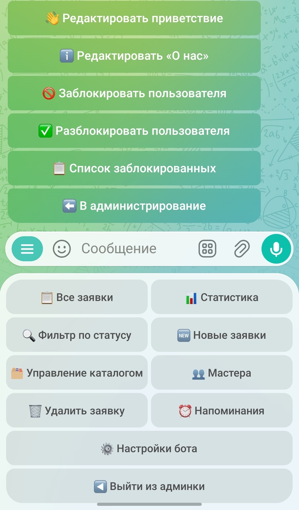
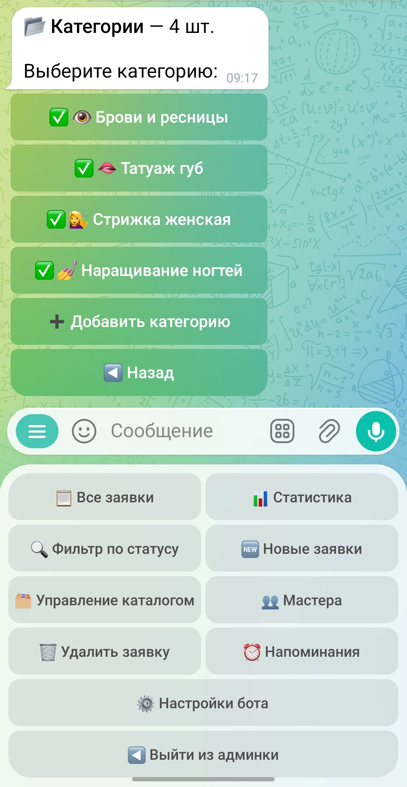
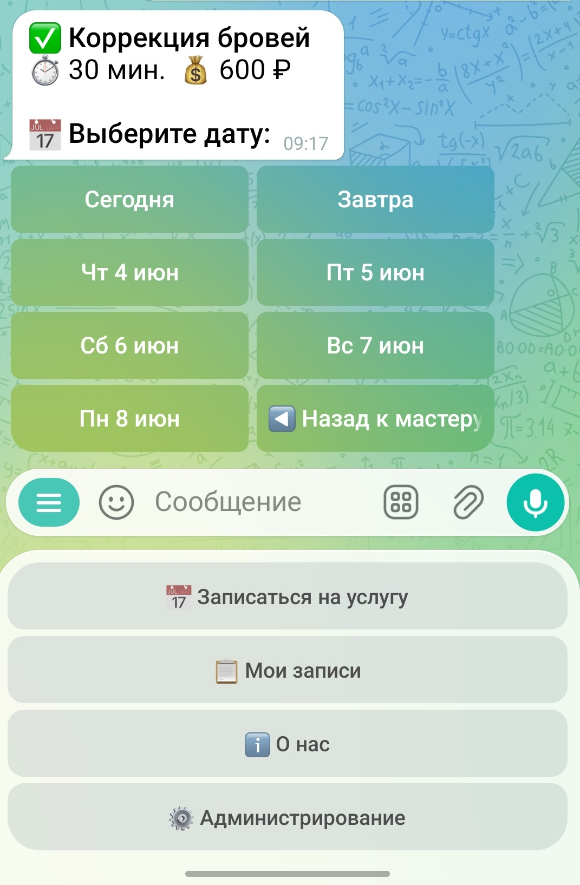
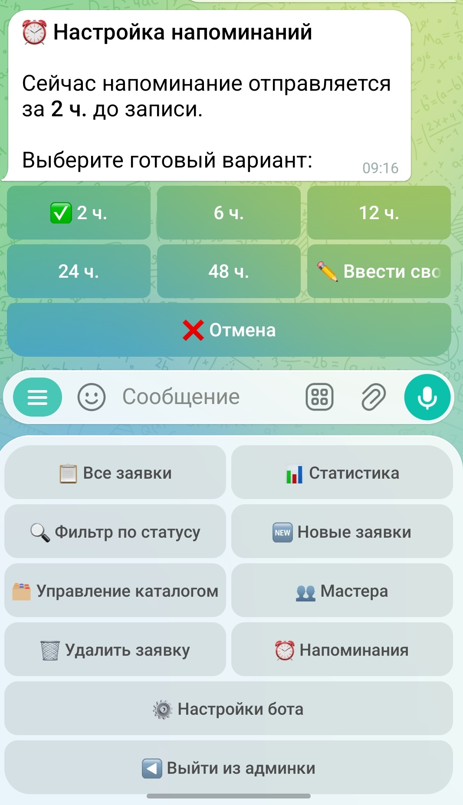
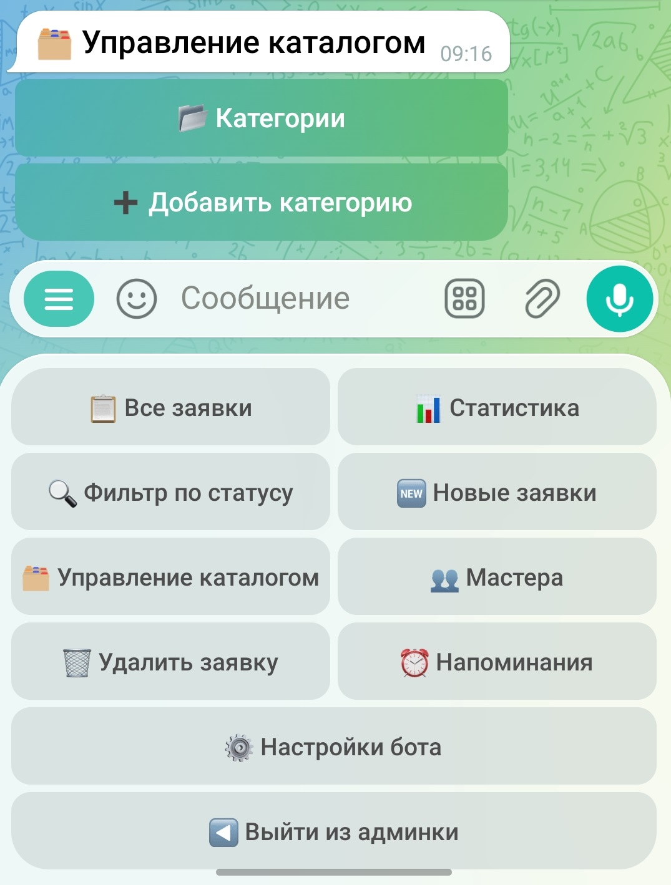
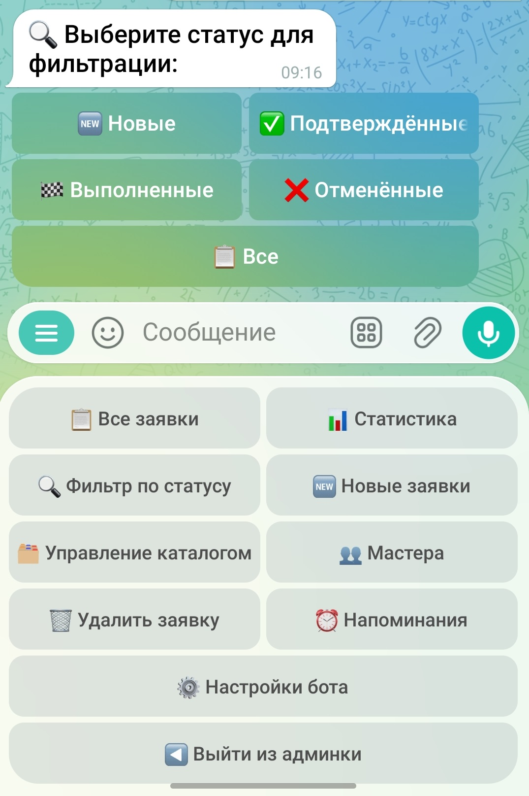
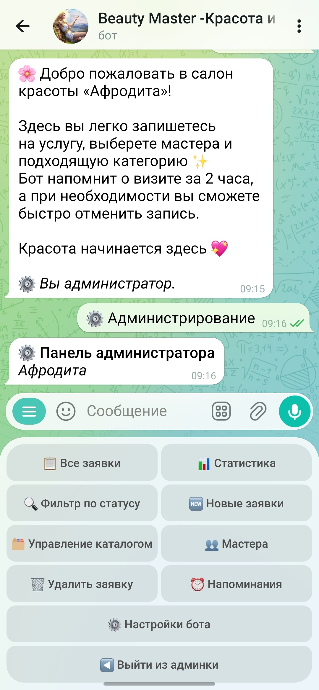
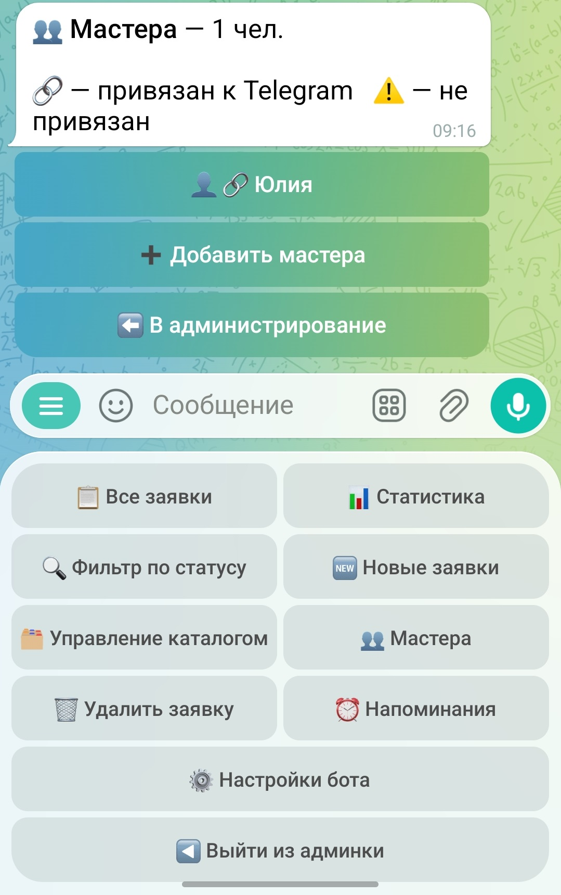

# Telegram-бот онлайн-записи для бьюти-сферы

### Ready-made Telegram booking bot for beauty businesses

---

## 🇷🇺 Русский

Готовый Telegram-бот для онлайн-записи клиентов в любом бьюти-бизнесе. Все тексты, услуги, мастера, категории и настройки изменяются прямо через Telegram — без программиста и без перезапуска.

### Для кого

Салоны красоты, барбершопы, студии маникюра и педикюра, спа и массажные кабинеты, студии бровей и ресниц, косметологи, нутрициологи и любой бизнес с записью по услугам и мастерам.

### Три роли с отдельными правами

**👤 Клиент**
- Пошаговая запись: категория → услуга → мастер → дата → время
- Выбор даты из доступных слотов с подсветкой занятых окон
- Просмотр своих записей и истории
- Самостоятельная отмена записи в статусах «Новая» и «Подтверждена»
- Автоматические уведомления о статусе заявки
- Напоминание о предстоящем визите
- Раздел «О нас» с адресом, контактами и описанием

**🧑‍🔧 Мастер**
- Отдельный режим мастера (доступен после привязки Telegram ID через администратора)
- Просмотр только своих записей с фильтром по статусу
- Подтверждение заявок и отметка о выполнении
- Мгновенные уведомления о новых клиентах
- Личная статистика

**⚙️ Администратор**
- Все заявки с постраничной навигацией
- Фильтр по статусу: новые, подтверждённые, выполненные, отменённые
- Подтверждение, отмена, удаление заявок — клиент и мастер получают уведомление автоматически
- Статистика в один клик
- Управление каталогом: категории и услуги (добавить, редактировать, удалить)
- Управление мастерами: имя, описание, Telegram ID, привязка к услугам
- Настройка напоминаний: готовые варианты (2 / 6 / 12 / 24 / 48 ч.) или своё значение
- Редактирование приветствия и блока «О нас» с поддержкой HTML
- Блокировка и разблокировка пользователей

### Логика подтверждения
- Есть Telegram ID мастера → уведомление мастеру, он подтверждает сам
- Нет Telegram ID → уведомление администратору

---

## 🇺🇸 English

A ready-made Telegram booking bot for beauty businesses of any format. All texts, services, masters, categories and settings are managed directly in Telegram — no developer needed, no restarts required.

### Who it's for

Beauty salons, barbershops, nail studios, spas, massage rooms, brow and lash studios, cosmetologists — any business that accepts appointments by service and specialist.

### Three roles

**👤 Client** — step-by-step booking (category → service → master → date → time), available slot calendar, booking history, self-cancellation, status notifications, visit reminder, "About us" section

**🧑‍🔧 Master** — dedicated mode after Telegram ID binding, own bookings only, confirm/complete appointments, new client notifications, personal stats

**⚙️ Admin** — all bookings with pagination, status filter (new / confirmed / completed / cancelled), confirm/cancel/delete with auto-notify, one-click statistics, catalogue management (categories + services), master management (name, description, Telegram ID, service binding), reminder settings (presets or custom hours), greeting and "About us" editor with HTML support, user blocking

---

## 🖥 Скриншоты · Screenshots

  
  
 

---

## ⚙️ Стек · Stack

- Python 3.10, aiogram 3.10
- YDB (Yandex Database) / PostgreSQL
- APScheduler — напоминания и уведомления
- Yandex Cloud Functions / VPS Ubuntu, systemd

---

## 💼 Коммерческий продукт · Commercial product

Исходный код закрыт. Поставляется под ключ, адаптируется под любой салон или нишу.  
Source code is not public. Delivered as a turnkey solution for any beauty business.

**Заказать · Order:**

- 🌐 [shashevpro.ru](https://www.shashevpro.ru)
- 🛒 [kwork.ru/user/andreysha256](https://kwork.ru/user/andreysha256)
- ✉️ programmer@shashevpro.ru
- 💬 [vk.com/andrey_shashev](https://vk.com/andrey_shashev)

---

**© ShashevPro · Andrey Shashev** — commercial software, source not public.

